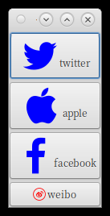
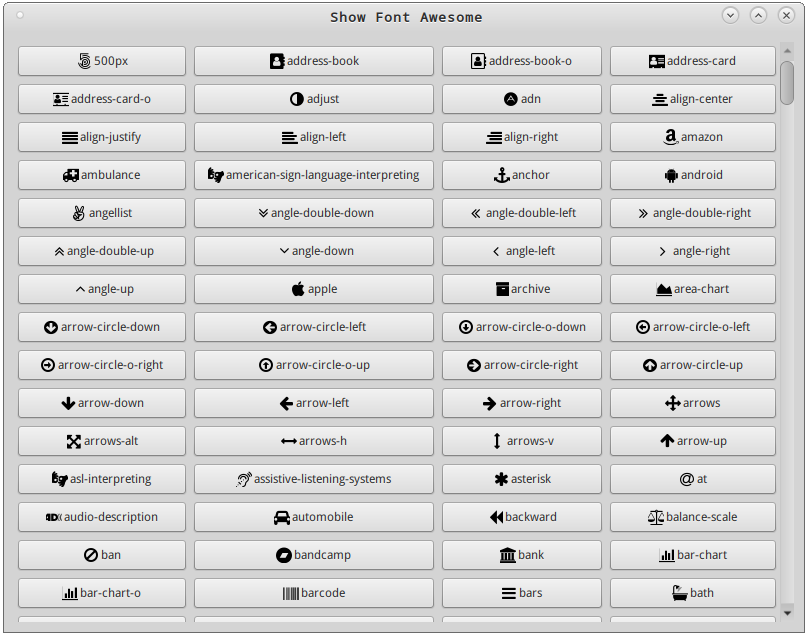

# GIconFont

GIconFont support to use icon font like FontAwesome for Gtk3 applications.

# Example


Use builtin icon font:

```
    GiconFont *font;
    GtkWidget *image;

    font = gicon_font_new();
    image = gicon_font_get_image (font, "facebook");

    gtk_button_set_image (GTK_BUTTON(button), image);
```

Use custom icon font:

```
    /* Test font from uri or path */
    gicon_font_set_font (font, "https://at.alicdn.com/t/font_115436_p8ay96nf93g.ttf");
    gicon_font_set_map (font, "https://github.com/yetist/giconfont/raw/master/example/code.map");
```

Snapshot for [example/main.c](./example/main.c)




